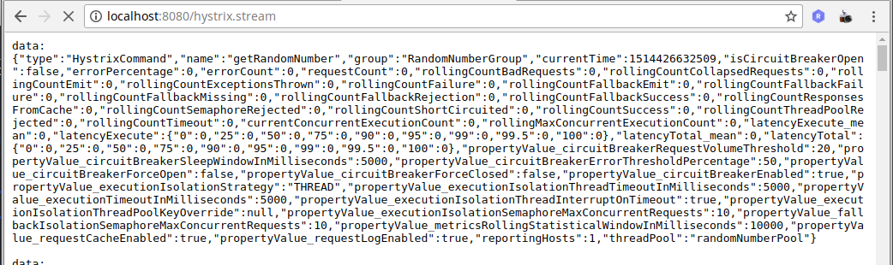
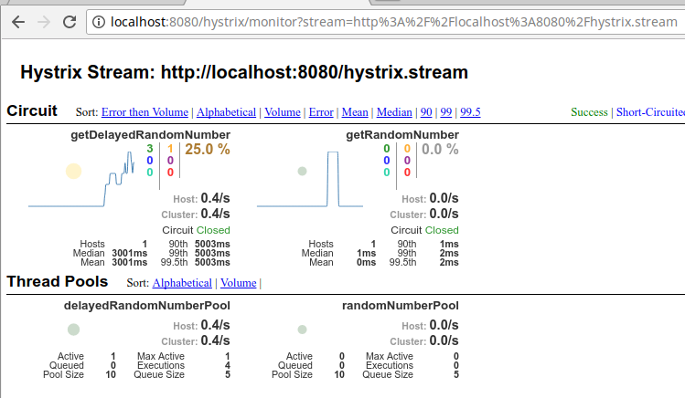

# Spring Cloud Hystrix example

## How to run
Run the project with
```
./gradlew bootRun
```
then, you can run the unit test code ( I know it is ugly but, it is just for example)
Unit test is located at 
```
/src/main/test/brian.boot.example.cloud.hystrix.RandomNumberControllerTest.java
```

This test will test two url /randomTest and /delayedRandomTest/{counter}

* /randomeTest has fallback method and it will return -1 for the randomly failed case
* /delayedRandomTest/{counter} does NOT have fallback method and it will throw RuntimeException. Hystrix Timeout exception will be triggered by random time delay on the Service layer. The timeout has been set as 5 seconds. The error will be handled by Exception handler to throw 500 Internal error.

## Hystrix & Streaming report
To use Hystrix, only one dependency is required. But, if you want to stream the data to hystrix-dashboard, actuator dependency must be there as well.
```
	compile('org.springframework.cloud:spring-cloud-starter-hystrix')	// Hystrix library
	compile('org.springframework.boot:spring-boot-starter-actuator')	// Reqiured : To stream the Hystrix report
```

When you add both dependencies, by the url `/hystrix.stream` you will see something like this.


## Hystrix Dashboard
All you need to have it is adding dependency and add a Annotation.

```
	compile('org.springframework.cloud:spring-cloud-starter-hystrix-dashboard')	// Hystrix Dashboard
```
Config on the Application Configuration

```
@EnableHystrixDashboard
```
After that, you can see the dash board by `/hystrix`. It will show you the main Hystrix welcome screen and you can enter the url what you want to see. In this case,
```
http://localhost:8080/hystrix.stream
```
then hit 'Monitor Stream' button. 





https://github.com/Netflix/Hystrix/wiki/Configuration